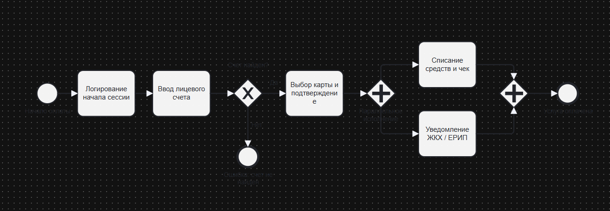
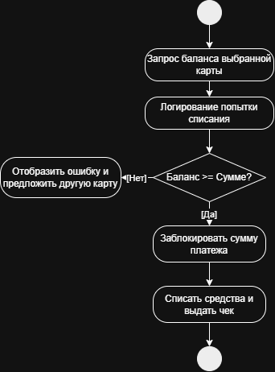
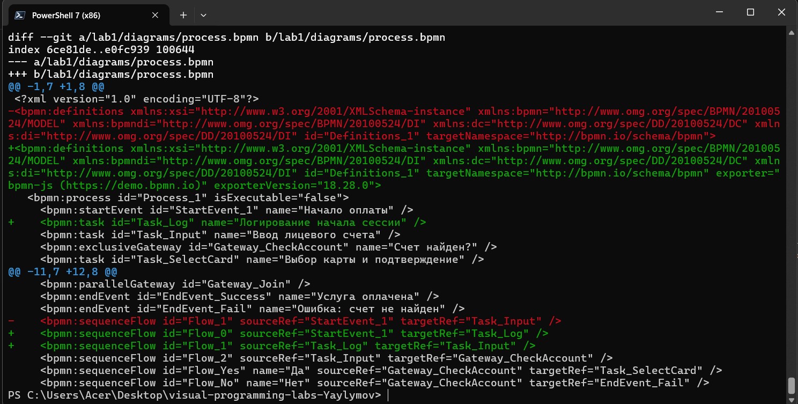

# Отчет по лабораторной работе №1
## Моделирование бизнес-процессов и версионирование в Git

**Студент:** Яйлымов Кервен  
**Тема процесса:** Оплата коммунальных услуг через мобильный банкинг

---

### 1. Краткое описание процесса
Рассматриваемый процесс описывает оплату ЖКУ через банковское приложение. Плательщик вводит номер лицевого счета, система валидирует его в расчетном шлюзе (ЕРИП) и запрашивает актуальную задолженность. При корректном счете и достаточном балансе на карте банк списывает средства, блокирует сумму, формирует чек и параллельно уведомляет расчетную систему ЖКХ для закрытия начисления.

---

### 2. Диаграммы процесса

#### 2.1. BPMN-диаграмма
Отражает весь сквозной процесс: от старта и проверки счета до параллельного списания средств и передачи данных в биллинг.

#### 2.2. UML Activity Diagram
Детализирует подпроцесс проверки баланса банковской карты, блокировки средств и обработки ситуации с нехваткой денег.

#### 2.3. Sequence Diagram (Mermaid)
Показывает обмен сообщениями между 4 участниками: Пользователем, Мобильным банком, ЕРИП и Биллингом ЖКХ (включая альтернативную ветку при ошибке).
> Исходный код доступен в [docs/sequence.md](docs/sequence.md).

#### 2.4. Flowchart (Mermaid)
Описывает пошаговый алгоритм валидации счета, проверки лимитов и подтверждения через 2FA/SMS.
> Исходный код доступен в [docs/flowchart.md](docs/flowchart.md).

---

### 3. Выводы
1. Освоил базовые команды Git (clone, add, commit, push, diff, mv) и работу с удаленным репозиторием по протоколу SSH.
2. Изучил на практике разницу версионирования текстовых и бинарных данных: текстовые форматы (XML в BPMN, Markdown Mermaid) дают прозрачный построчный diff с выделением изменений, а бинарные (.png) отслеживаются только фактом модификации файла.
3. Научился моделировать один и тот же бизнес-процесс под разными углами: общая последовательность (BPMN), взаимодействие сущностей во времени (Sequence), внутренние алгоритмы принятия решений (Activity, Flowchart).

---

### 4. Демонстрация Git Diff
Ниже представлен вывод команды `git diff`, демонстрирующий разницу отслеживания текстовых изменений в `.bpmn` (построчные вставки и удаления) и бинарных файлов `.png`:

